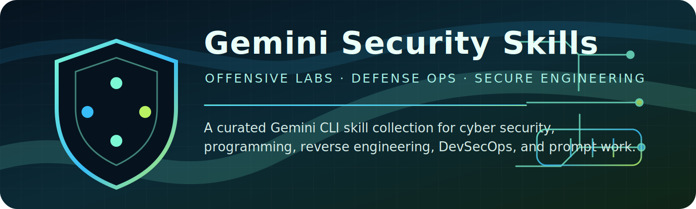

# Gemini Security Skills



Gemini Security Skills is a curated collection of `SKILL.md` capabilities for
Gemini CLI. The repository focuses on practical cyber security work, secure
engineering, programming, reverse engineering, SOC workflows, prompt
improvement, and multilingual communication.

Repository URL:

```text
https://github.com/Masriyan/gemini-security-skills
```

## What is included

This repository contains 12 skills:

- `go-programming`: Build, debug, test, and review idiomatic Go systems.
- `python-programming`: Build, test, type, package, and maintain Python code.
- `assembly-programming`: Read, write, explain, and debug low-level assembly.
- `offensive-security`: Plan authorized offensive security assessments.
- `exploit-development`: Analyze lab vulnerabilities and safe proof of concept
  workflows.
- `malware-reverse-engineering`: Triage suspicious artifacts and produce
  defensive findings.
- `devsecops`: Harden CI/CD, infrastructure, containers, and releases.
- `soc-operations`: Triage alerts, hunt threats, and produce incident notes.
- `cybersecurity-partner`: Act as a practical security reviewer and advisor.
- `prompt-enhancement`: Improve prompts, task specs, and agent instructions.
- `multilingual`: Translate, localize, and improve multilingual content.
- `claude-mythos-emulation`: Create Claude-like assistant behavior specs
  without identity claims or proprietary prompt copying.

## Install into Gemini CLI

Install Gemini CLI first:

```bash
npm install -g @google/gemini-cli
```

Recommended extension install:

```bash
gemini extensions install https://github.com/Masriyan/gemini-security-skills --consent
```

Restart Gemini CLI after installing the extension, then verify the bundled
skills:

```text
/skills list
```

For a direct global skills install without using extensions:

```bash
git clone https://github.com/Masriyan/gemini-security-skills.git
cd gemini-security-skills
mkdir -p ~/.gemini/skills
cp -R skills/* ~/.gemini/skills/
gemini
```

Inside Gemini CLI, verify that the skills are loaded:

```text
/skills list
```

If Gemini CLI is already running after you copy the skills, reload them:

```text
/skills reload
```

For project-only installation, copy the skill folders into the target project:

```bash
mkdir -p .gemini/skills
cp -R /path/to/gemini-security-skills/skills/* .gemini/skills/
```

Some Gemini CLI versions also provide `gemini skills` terminal utilities for a
single skill repository or local `.skill` package:

```bash
gemini skills install https://github.com/Masriyan/gemini-security-skills
```

For active local development, linking avoids repeated copying:

```bash
gemini skills link ./go-programming
gemini skills link ./offensive-security
gemini skills link ./malware-reverse-engineering
```

Repeat the `link` command for each skill you want to test.

## Documentation

Read the documentation set for installation details, usage patterns, and skill
knowledge:

- [Installation guide](docs/installation.md)
- [Skill catalog](docs/skill-catalog.md)
- [Gemini CLI usage](docs/gemini-cli-usage.md)
- [Security boundaries](docs/security-boundaries.md)
- [Cybersecurity workflows](docs/cybersecurity-workflows.md)
- [Programming workflows](docs/programming-workflows.md)
- [Prompting and multilingual workflows](docs/prompting-and-multilingual.md)
- [Development and maintenance](docs/development-and-maintenance.md)
- [Troubleshooting](docs/troubleshooting.md)

## Safety model

The cyber security skills are written for authorized, defensive, educational,
and lab-scoped work. They emphasize scope confirmation, safe proof, containment,
reporting, and remediation. They intentionally avoid unauthorized access,
stealth, persistence, credential theft, destructive activity, and malware
improvement.

## Repository layout

Each skill is self-contained:

```text
skills/
└── skill-name/
    ├── SKILL.md
    └── agents/
        └── openai.yaml
```

The repository also keeps root-level skill folders for direct copy workflows.
Gemini CLI extensions use the `skills/` directory. Gemini CLI primarily uses
`SKILL.md`. The `agents/openai.yaml` files provide UI metadata for compatible
agent environments.

## Source references

The installation docs were checked against current Gemini CLI Agent Skills and
CLI management behavior on May 9, 2026. Relevant upstream references:

- Gemini CLI Agent Skills overview:
  https://geminicli.com/docs/cli/skills/
- Gemini CLI managing Agent Skills:
  https://geminicli.com/docs/cli/using-agent-skills/
- Gemini CLI extension reference:
  https://geminicli.com/docs/extensions/reference/
- Gemini CLI command reference:
  https://google-gemini.github.io/gemini-cli/docs/cli/cli-reference.html
